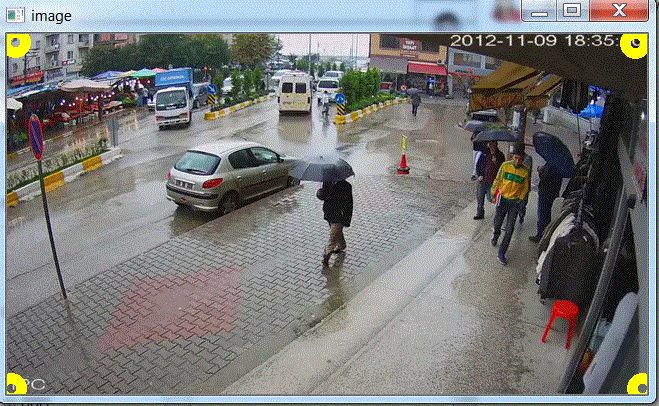
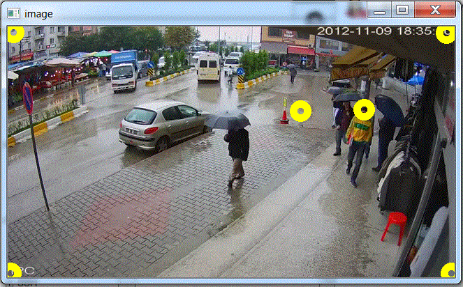
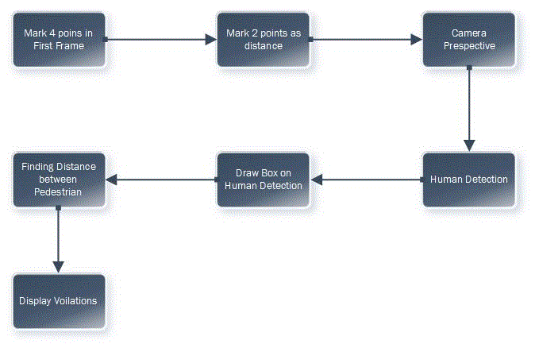

# AI QuaranTeams 

# Short Description
Efficient Solution to monitor Social Distancing and take corrective measures

# Long Description
AI Quarateams in a complete solution for capturing social distancing violation happening in an area . This can be teamed up to find the voilations happening in other areas and get the cummulative data .Based on the alarming situation in each area their respective Local Administrators can be informed using a Text Message/Email Services . We can compare the statistics of different areas and figure out which region needs more attention based on the active cases and new violations happening .
Solution can be described in 3 Sections 

Section -1 
Model for Object Detection, where Camera feed will be an input to the model for detection of  voilations based on the distance set by the user as a minimun required  distance .
The data will be analysed per frame and can be stored in central server/repository.
The Model is based on python tensor flow neural networks . Model has been trained by providing various images and manually labelling the images to differentiate between human and other objects.For object detection in a video feed , openCv has been used to get the camera perspective and perspective transformation for finding the minimum distance required for social distancing.We are using condense matrix implementation for identifying the distance between many objects detected within a particular frame.If the distance is less than the threshold value , voilation count increases.

UI 
Section -2 
Authorized user can view the data using our website. On Successful user login , google AP will request for the user location and display the user's location data (user location is a default location). Other Regions data can be seen by selecting the location on google map .
Based on the region selection the data will fetched from central server along with the live feed. Statistics of different regions can be compared . For alarming situations SMS/Email can be sent to the designated person.

Mobile App and QR Code 
For Easy Handling QR code and  Android Mobile Application has been created . User can view the voilations on mobile phones .

Section -3 
Data Filteration :
Raw Data obtained from Section-1 is stored in central server/db/respository . When enduser requests to view the statistics from UI , raw data is fetched for requested location  from central server and  cummulative data is prepared using Global API's which gives the information about the current cases within the requested area , zone information .
```
# Getting Started 
The instructions can help you to install the project on you local environment

##Prerequisite 

Softwares required 
1. Windows Server
2. Python 3.5 or above 
3. Deploy a windows server 2019 - Please note if Linux is used then make sure linux is installed with desktop 
4. For Linux server enable the X11 Forwarding and gnome 
5. Install Python 3.5 or above 
5. If Pip 20.0 is not available then use get-pip.py 
   and run python get-pip.py
```

##Clone the repository
```
git clone https://github.com/deepikagarg01/AI-Quaranteams.git

## Run the project
```
Steps 
cd AI-Quaranteams
1. pip install –r requirements.txt
2. pip install -q tensorflow==2.0.0-alpha0
3. resolve the dependencies using pip -install
4. pip install imageio
5. pip install ffmpeg
6. pip install imagio-ffmpeg
7. run command python main.py --videopath "VideoPath" --region "Area_Name"
8. output will be a CSV File and .mp4 video .mp4 for bird eye view


Running main.py will open a window of the first frame in the video. At this point the code expects the user to mark 6 points by clicking appropriate positions on the frame.

#### First 4 points:
The first 4 among the 6 required points are used to mark the Region of Interest (ROI) where you want to monitor. Moreover, the lines marked by these points should be parallel lines in real world as seen from above. For example these lines could be the curbs of the road.
These 4 points need to be provided in a pre-defined order which is following.

* __Point1 (bl)__: Bottom left
* __Point2 (br)__: Bottom right
* __Point3 (tl)__: Top left
* __Point4 (tr)__: Top right


#### Last 2 points:
The last two points are used to mark two points 6 feet apart in the region of interest. For example this could be a person's height (easier to mark on the frame)

The gif below will help understand the points better


```

## How does it work?
The complete block diagram of the algorithm can be seen below.



## Project Documentation
The Diagram shows the High Level Design 

The Diagram shows the Human Detection Process


